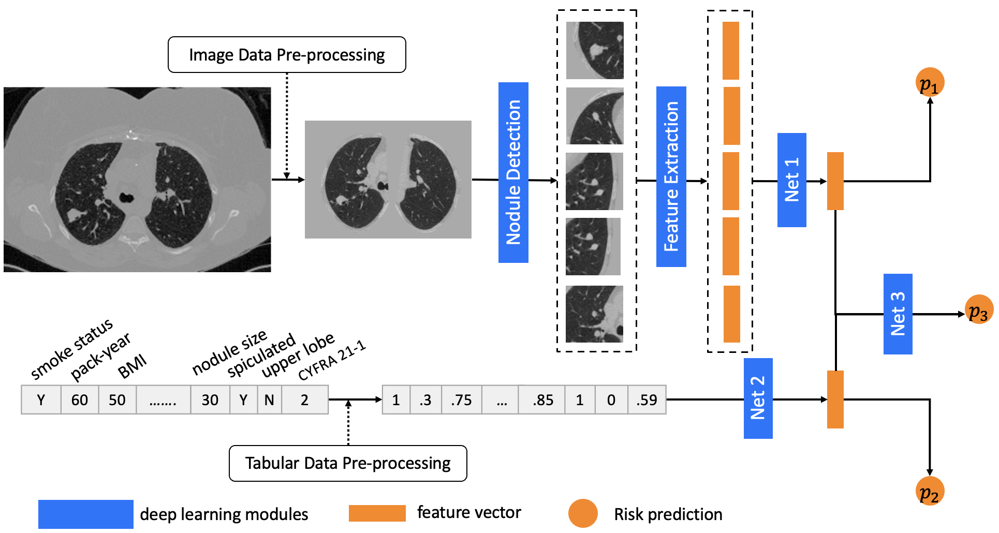

# DeepLungIPN Overview

This is the Deep Learning Open-source Lung cancer risk estimation repository, with PyTorch implementations. We prevoide source code, running tutorial, pre-trained model, [example image](https://drive.google.com/drive/folders/1gyKfWa_vmI_0K0dZ_lBUynCnOJhy3dKU?usp=sharing) in this repository, some codes are borrowed from our [screening study repository] (https://github.com/MASILab/DeepLungScreening).


# Tutorial

The whole pipline are shown as: 


<p align="center"> Fig. 1. Our network structure for multi-modal prediction. The image-path (upper) includes the pre-trained nodule detection and feature extraction modules. Then, the features from the five regions with highest nodule confidence are feed into an attention-based multi-instance learning module (i.e., Net 1) to obtain an overall feature vector from the whole CT. The tabular-path (lower) is feed by normalized data elements and tabular features are extracted by two fully connected layers (Net 2). The joint path is fed by the concatenation of image and tabular features with another two fully connected layers (Net 3). </p>


## step 1: image pre-process

> python3 ./1_preprocess/step1_main.py --sess_csv ${SPLIT_CSV} --prep_root ${PREP_ROOT} --ori_root ${ORI_ROOT} 

```${SPLIT_CSV}``` is the csv file stores the scan list (and meta data) you want to test. 
```${PREP_ROOT}``` is the data folder saves the pre-processed result.
```${ORI_ROOT}``` is the data folder stores the scans you want to test.

## step 2: nodule detection

> python3 ./2_nodule_detection/step2_main.py --sess_csv ${SPLIT_CSV} --bbox_root ${BBOX_ROOT} --prep_root ${PREP_ROOT} 

```${BBOX_ROOT}``` is the data folder stores the nodule detection results.

## step 3: feature extraction

> python3 ./3_feature_extraction/step3_main.py --sess_csv ${SPLIT_CSV} --bbox_root ${BBOX_ROOT} --prep_root ${PREP_ROOT} --feat_root ${FEAT_ROOT}

```${FEAT_ROOT}``` is the data folder stores the image feature results.

## train the co-learning model 

> python train_main.py

## step 4: co-learning of meta data and image

> python3 ./4_co_learning/step4_main.py --sess_csv ${SPLIT_CSV} --feat_root ${FEAT_ROOT} --save_csv_path ${PRED_CSV}

```${PRED_CSV}``` is the predicted result from deep learning method.

# Contact 

Email: riqiang.gao@vanderbilt.edu for any questions and supports. 


